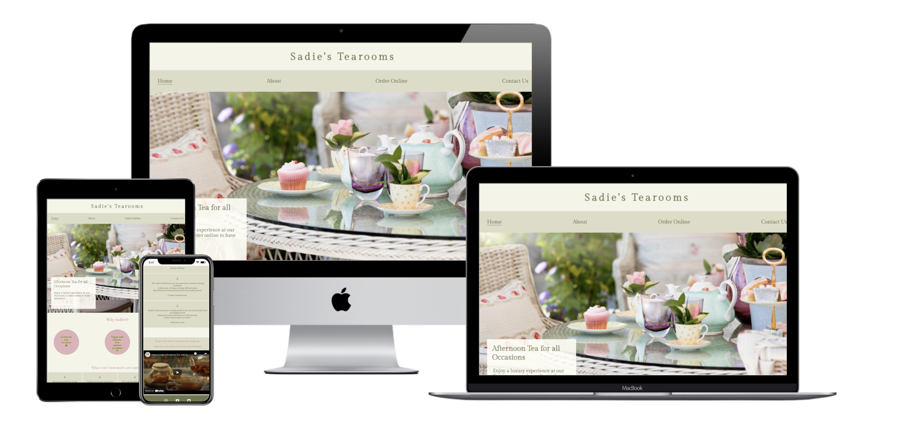

# Sadie's Tearooms - Portfolio Project 1 HTML/CSS

 

Link to the live website [here.](https://sarahob96.github.io/sadies_tearooms/)
 ## Table Of Contents
   - Objective
   - Concept
     + wireframes
   - UX design
     + User stories
   - Design
     + Colour Scheme
     + Typography
     + Imagery
     +Site layout
  - Features 
  - Technologies Used
  - Testing
    + Manual Testing
    + Validation
    + Bugs/errors
 - Deployment
 - Credits
      

## Objective
This website will advertise a fictional tearooms that offers a luxurious Afternoon Tea.    The site should give the user a taste of what to expect when they indulge in the   afternoon tea experience that's on offer. The website will include a main page with an  impactful hero image, an about page to further inform the user about the company, an order form feature to allow the user to order their afternoon tea to collect and finally a contact page where the user is given a number of contact options including a contact form.

## Concept
Afternoon tea is a foodie's dream. Sadie's offers a selection of cakes and savoury treats alongside a selection of tea's and coffee's. These can be enjoyed and shared with friends and family to celebrate all occasions and also offering the possibility to bring that experience wherever you want.

 # Wireframes
    
   Wireframes for Desktop, Tablet and Mobile can be found [here.](https://github.com/sarahob96/sadies_tearooms/blob/main/Sadies_tearooms%20.pdf)
    
## UX Design

 ### First Time Visitor Goals
  
 - As a first time user, I want to know what service/product is being offered. 
 - As a first time user, I want to navigate swiftly through the site on a number of devices.
 - As a first time user, I want to see a menu so I know whats included.
 - As a first time user, I want to know the cost of the product.
 - As a first time user, I want to see testimonials to know what previous customers thought. 
   
 ### Returning Visitor Goals
  
  - As a Returning User, I want to easily make an order.
  - As a Returning User, I want to find an address to know where the tearooms are located. 
  - As a Returning User, I want to see if there is a newly updated menu.   
  - As a Returning User, I want to find contact information.
  - As a Returning User, I want to access their social media.
  
  
# Design

 ###  Colour Scheme
    
  - I wanted to go for a muted colour scheme to give the website a minimalist and contemporary feel. 
  - The two main colours seen on the site are a Sage tone and cream. Initally I was keeping to only green and cream tones but decided to add pops of pink around the site to add some contrast and also highlight certain parts of the site. 
  -  I wanted the muted tones of sage and cream to allow users to feel relaxed while browsing through the site. This also portrays the environment of the tea rooms.
    
  ### Typography
   
 -   I wanted the name "Sadie's" to be written in an italics style font. I settled on the font "Gilda Display". It is used throughtout the site as I feel it gives the text elegance which fits in well with the site. 
- The font Dosis is also used in certain sections across the site. Initially I thought it would be 50/50 using both style fonts, however as progress of the site began I realised Gilda Display suits the site most.
    
    
 ###  Imagery
   
- Images seen on the website were sourced from [Deposit Photos](https://depositphotos.com/) and [px here](https://pxhere.com/).
- Bright, elegant imagery is used throughout the site. I wanted the images to show the high quality experience on offer to the user.
- I chose the Hero image on the home page as it instantly conveys to the user an experience that they would enjoy, enticing them to come and avail of the service. The hero image also embodies the colour scheme of the site with delicate greens, pinks and creams are seen in the image.
- I also added a textbox with a small description so the user does not have to go far to know exactly what the site is offering them. 
-Similarly, the imagery seen on the about page is also used to further convey the experience on offer. The photos have simple yet effective descriptions. "Photo Worthy" afternoon tea is used and would appeal to a lot of users today as social media becomes bigger and people want an experience not only just enjoyablee but also "instagrammable". 
    
### Site Layout

 - The site consists of four pages that can be accessed from the navigation menu and 3 others not accessible from the nav section. Two of these are seen when the order form and contact form is submitted and third page shows the afternoon tea menu which can be accessed through a hyperlink found on the 'order online' page. 
* Main page 

   

 - The landing page boasts a large hero image with a text box describing briefly whats on offer. Further down the home page we have a simple section display three reasons to love "Sadies". A testimonial section follows so the user can see what other users thought. Finally a 'recipe of the month' section contains a video with a recipe for a festive tea to fit in with the season we are in.

 * About
 
   - The 'about' page simply contains a block of text to inform the user, followed by three eye catching images with descriptive text.
   -
* Order online
  - This page contains an order form to allow the user to order their Afternoon Tea for collection. A hyperlink is also displayed which opens a 'menu' page.
  
* Contact us
  - A number of contact options including the sites email, phone number and address are display. A contact form is also shown. Social links are display in the footer of every page for quick access.

## Features

 ### Existing Features
   - Main Heading -  The 'Sadie's Tearooms' heading is seen on all pages. It contains an anchor element which allows the user to return to the home page once clicked on.
  - Navigation menu -
    * The Nav bar allows the user to get around the site with a click. A hover feature appears when hovering over nav menu sections. The page the user is currently on will be underlined on the navbar, allowing the user to always know where they are on the site.
   * On smaller devices, the nav menu has been programmed to toggle from the standard menu display to a burger menu on devices 850px and lower.
  
  
  
 - Landing page - consists of the big hero image with a small text box. I didn't want to overwhelm the user with a lot of information at first look so kept it minimal with a brief description.
  
  * The landing page also contains a key points feature that enlarge once hovered over. Similarly the points are kept brief but effective. 
 
  
 
  * The testimonial section on the landing page effectively shows the user what past users have experienced. This subconciously builds trust between the user and the company, as they know others have had positive experiences. 

 
  
  * A video element on the landing page gives the user a nice incentive for visiting the site. This section would allow users to want to visit more frequently to recieve a recipe from one of the current menu items.
   
  
 -about page
  * This section gives the user more in depth detail about the tearooms and whats on offer. Three images are used with simple text to allow the user to further visualise the experience thats on offer.
  
   
  
 - Order online page

   
    * The order form allows the user to order their afternoon tea for collection. I referenced the current COVID situation on the about page as a reason to have introduced this feature. The order form allows the user to order for up to 6 people and choose a date of their choice with only future dates as options to give the site a realistic feel. A textbox featured on the form gives the user the choice to list any special dietary requirements as gluten free and vegan options are necessary in todays society. 
  * The page features a hyperlink that once clicked, opens a page in a new window that displays the current menu. 
  * Once the order form is submitted, the user is met with a new page displaying an order confirmation. 

- Contact us page
 
* The contact form is kept simple but offers a convienent way for the user to instantly get in touch. A phone number and email address is provided for users preference.  The contact form once submitted opens a new page with a thank you message, letting the user know they successfully got in touch.

- Footer

The footer contains 3 social network hyperlinks that can be accessed through clicking the corresponding network icon. 

 

### Features to be implemented
- A Pay Online feature - currently only using HTML and CSS, it was not achievable for me to insert this feature so instead we had an order for collection- pay instore method. A pay online element would make the process more efficient for the user so they have it ordered and payed for quickly and do not have to worry about it when collecting.

- Currently, the information filled in the form does not go anywhere. Currently a new page displays to give the impression to the user that their order/information has been recieved . With more knowledge in the future I would like to implement an action and method attribute so the information is stored somewhere.

## Technologies Used

-[Balsamiq](https://balsamiq.com/) 
    * I used Balsamiq to create my wireframes for phone, tablet and desktop.
- Google chrome DevTools
    * Chrome Devtools was a very useful tool throughout the project and heavily used when       I was creating the media queries.
- [Font Awesome](https://fontawesome.com/)
    * A number of icons used across the site were sourced from the Font Awesome pack.
- Google Fonts
    * Both fonts used throughout the site were imported from Google fonts.
- Multiple Device Image generator
    * I used [techsini.com](https://techsini.com/multi-mockup/) to generate the multiple        device image at top of this file. 
- Beautify
    * I used the VS code extension in gitpod to auto format my code.
- W3C Markup and CSS validation Service
    * I used the validator to check both my [HTML](https://validator.w3.org/) and [CSS](https://jigsaw.w3.org/css-validator/) code and ensure there were no errors.

## Testing 

### User Story testing 

 - "As a first time user, I want to know what service/product is being offered" 
    * The text box and hero image give the user a instant idea of what is being offered. Further on, the about      section informs the user further.
    
 - "As a first time user, I want to navigate swiftly through the site on a number of devices."
    * The navigation menu on larger devices and the hamburger menu on smaller devices ensures the user gets around the site easily. Clicking on the 'Sadies' title from any page brings the user back to the home page.
    
 - "As a first time user, I want to see a menu so I know whats included."
    * A menu is given to the user through a hyperlink so they can view the menu in another tab while filling out     the order form.
    
 - "As a first time user, I want to know the cost of the product."
   * The cost of the product is given instantly to the user on the home page as an attractive feature of the         afternoon tea and the tearooms.
   
 - As a first time user, I want to see testimonials to know what previous customers thought. 
   * The testimonial section on the home page provides the user with knowledge of what other users thought.
   
 ### Returning Visitor Goals
  
  - "As a Returning User, I want to easily make an order."
   * The order form makes it easy for users to submit an order.
   
  - "As a Returning User, I want to find an address to know where the tearooms are located."
   * The about page gives the user a general location and further on, the 'contact us' page shows the exact address.
   
  - "As a Returning User, I want to see if there is a newly updated menu."
  * On further visits to the site, updated menus would be available to the user. The 'recipe' of the month feature entices the user to return frequently.
  
  - "As a Returning User, I want to find contact information."
   * Contact information can be found on the contact page 
   
  - "As a Returning User, I want to access their social media"
   * Social media icons on the footer allow for easy social media access.
   
  ### Manual testing
  A number of manual tests were done on the site to ensure everything worked and looked     how it was supposed to.
  - The site was tested on a number of browsers - Chrome, Safari and Microsoft Edge. 
  - I viewed the site on various screen sizes through Chrome Dev tools and also through my   own phone device.
  - I ensured all anchor elements worked effectively and that the external social links opened in new tabs and on the right site. 
  - Both forms work as they are designed to. The user cannot submit the form when required   fields are left blank. 

### Validation 
  As my code was HTML and CSS. I ran the code for each page through the W3C markup validation service which ensured my code was valid. 

* HTML Validator
  

* CSS Validator
  
  
* Lighthouse - Google Chrome 
  - I used the lighthouse feature in google chrome dev tools to test for performance, accessibility, best practices and  SEO. All areas scored high.
  

 - Best practices scored slightly lower due to 'Same Site cookie' from the youtube video element.

### Bugs/errors 
#### Resolved
  - When creating the testimonial section on my main landing page,  I encountered a bug when I was toggling from a smaller device screen to a large device. At desktop size, the testimonial section initially had a display of "table cell". However, using a media query for smaller devices, I wanted this section to flow downwards so that each review took up the width of the screen using a display of "inline-block". While the transition from a large screen to a smaller screen worked nicely, when I went back from a smaller to larger display, the testimonial section remained how it looked on a smaller device. Upon further investigation and ensuring my media queries were correct, I found that there was a known bug when toggling using the 'table-cell' display. I decided to change the display of this section at full desktop version using a float element which gave me the result I wanted. 

  - While running code throught the W3C validator, minor syntax errors were found and fixed easily.

### Current
  - When testing the reponsiveness of the site, I noticed an error with the footer which can only been on the tablet devices. The footer floats up noticeably.
 
     
 
  - If footer code was changed, it would have affected the whole site on all devices so I left it as is for now. In future projects, I will ensure the style given to the footer will stop this from happening in the future. Ideally I would have set values for my body height and made the footer absolute while the main relative. 

## Deployment

 - I created this project in Gitpod.
  1) On Gitpod, access the sites repository
  2) Click the settings button underneath the repository name
  3) Navigate to the pages section on the left hand side menu
  4) On this page, under source, choose the main or none option from the menu and choose the root location
  5) Click save

## Credits 

### Media
  - Desposit Photos
  - PX here
  - SVOYA production on You tube for the main page video element
  
### Code
  - Credit to Caler Edwards (You Tube) where I used and adapted the code for the responsive hamburger menu used for smaller devices. 
  - A mention to Stack overflow for some problem solutions.
  - Code for my hover affect on the three circle points was adapted from [Web designer depot](www.webdesignerdepot.com).
  
### Acknowledgements
  - A special mention to Davey JH - code institute student for his README.md file structure.
  - I want to thanks friends and family who viewed the site on their own devices and gave me helpful feedback.
  - I would like to thank my Mentor at Code Institute, Narender Singh for his guidance and advice along the way with this project.
